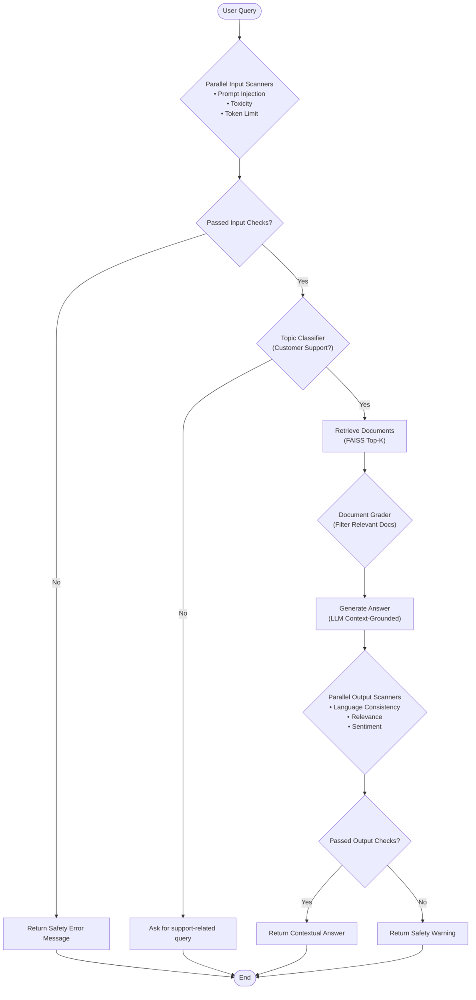
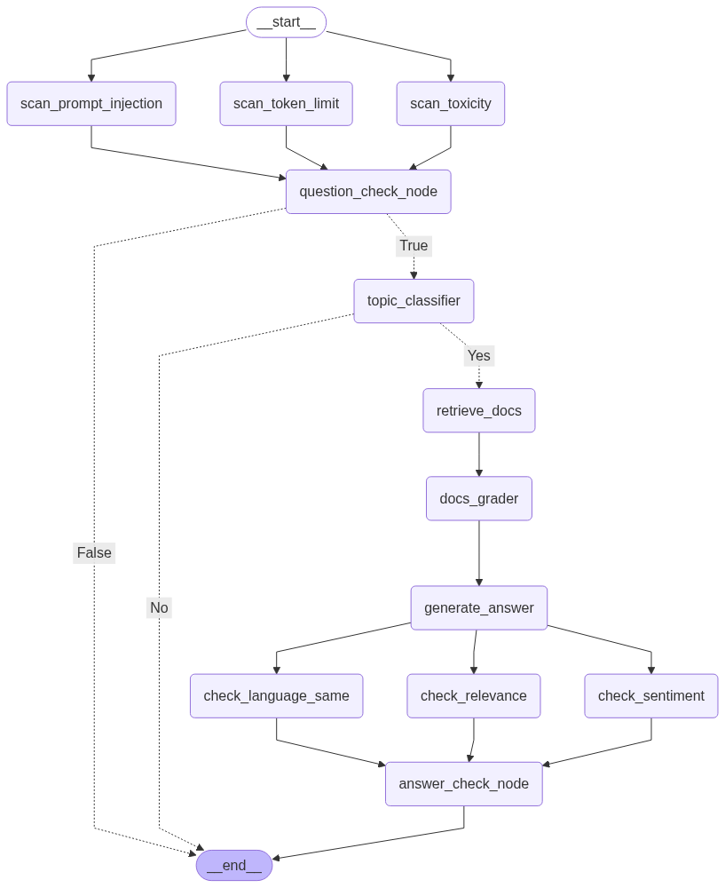

# 🤖 Customer Support Agentic RAG

**An intelligent, production-ready Customer Support assistant built with LangGraph, LangChain, FAISS, and LLM Guard for robust, context-aware, and safety-verified customer query resolution.**

---

## 🚀 Overview

This project implements an **Agentic Retrieval-Augmented Generation (RAG)** system designed specifically for customer care and support automation. It orchestrates a multi-stage graph workflow that pairs semantic document retrieval with pre- and post-generation safety guardrails.

The system supports both cloud-based inference (via **Groq** running `llama-3.3-70b-versatile`) and local inference (via **Ollama** running `llama3.2:3b`), backed by a high-performance **FAISS** vector store and an interactive **FastAPI** backend with a built-in web chat interface.

---

## ✨ Key Features

- **Agentic Workflow Orchestration**: Built with **LangGraph** to model stateful decision-making, conditional routing, and fallback mechanisms.
- **Input Guardrails & Safety Scanners**: Uses **LLM Guard** (ONNX runtime) to scan inputs concurrently for prompt injection, toxicity, and token limit violations.
- **Structured Topic Classification**: Fast classification to ensure incoming queries pertain to customer support (orders, refunds, returns, product/account issues) before incurring retrieval costs.
- **Semantic Vector Search**: High-speed similarity retrieval over indexed customer care data using **FAISS** and **Hugging Face Sentence Transformers** (`all-MiniLM-L6-v2`).
- **Document Relevance Grading**: Evaluates retrieved chunks dynamically to filter out noise and irrelevant context before passing them to the generator.
- **Output Quality & Safety Verification**: Post-generation checks verify language consistency, answer relevance, and positive/neutral sentiment before responding to the user.
- **Built-in Web Chat Interface**: Clean web UI accessible via browser at `http://localhost:8000` alongside full REST API endpoints.
- **Automated RAGAS Evaluation Pipeline**: Built-in evaluation measuring Context Recall, Faithfulness, and Factual Correctness with HTML report generation.
- **High-Performance Data Processing**: Preprocessing pipeline powered by **Polars** for fast dataset filtering, deduplication, and vector indexing.

---

## 🏗️ Architecture & Workflow



<p align="center">
  
</p>

---

## 🛠️ Tech Stack

| Component | Technologies |
|---|---|
| **Workflow Orchestration** | [LangGraph](https://github.com/langchain-ai/langgraph), [LangChain](https://github.com/langchain-ai/langchain) |
| **LLM Inference** | Groq (`llama-3.3-70b-versatile`), Ollama (`llama3.2:3b`) |
| **Vector Store & Search** | FAISS (`faiss-cpu`), `langchain-community` |
| **Embedding Model** | `sentence-transformers/all-MiniLM-L6-v2` |
| **Safety & Guardrails** | [LLM Guard](https://github.com/laiyer-ai/llm-guard) (ONNX Runtime, PyTorch) |
| **Backend & Web Server** | FastAPI, Uvicorn |
| **Data Processing** | Polars, PyArrow, Datasets |
| **Evaluation Framework** | [Ragas](https://github.com/explodinggradients/ragas) (Context Recall, Faithfulness, Factual Correctness) |
| **Logging & Config** | Loguru, Pydantic-Settings |

---

## 📁 Repository Structure

```
├── assets/
│   └── flow.png                      # Generated LangGraph workflow diagram
├── data/
│   └── indexes/
│       └── faiss_index.faiss/        # Serialized FAISS index & metadata
├── evaluation_results/
│   ├── evaluation_results.html       # Detailed Ragas evaluation dataset report
│   └── mean_scores.html              # Aggregated benchmark scores
├── logs/                             # Application and preprocessing logs
├── src/
│   ├── api/
│   │   ├── static/                   # Web frontend assets (HTML, CSS, JS)
│   │   │   ├── index.html
│   │   │   ├── script.js
│   │   │   └── styles.css
│   │   └── main.py                   # FastAPI application & endpoints
│   ├── evaluation/
│   │   └── evaluate_rag.py           # Ragas evaluation pipeline
│   ├── graph/
│   │   ├── answer_check_node.py      # Output guardrails (relevance, sentiment, language)
│   │   ├── answer_node.py            # Contextual answer generation
│   │   ├── docs_grader_node.py       # Document relevance grader
│   │   ├── graph.py                  # LangGraph workflow compilation & flow visualizer
│   │   ├── question_check_node.py    # Input guardrails (injection, toxicity, token limit)
│   │   ├── retriever_node.py         # FAISS vector retriever node
│   │   ├── state.py                  # Graph state definitions (AgentState)
│   │   ├── topic_check_node.py       # Customer support topic classifier
│   │   └── utils.py                  # FAISS index loader utility
│   ├── indexing/
│   │   └── preprocess.py             # Polars data download, cleaning, and vector indexing
│   └── config.py                     # Centralized Pydantic application settings
├── .env.example                      # Environment variable template
├── langgraph.json                    # LangGraph CLI configuration
├── pyproject.toml                    # Project metadata and dependencies
├── requirements.txt                  # Python dependencies
└── README.md                         # Project documentation
```

---

## ⚙️ Setup & Installation

### 1. Prerequisites
- **Python 3.10+** (Python 3.12 recommended)
- **Git**
- Optional: [Ollama](https://ollama.com/) if running LLMs locally (`ollama pull llama3.2:3b`)

### 2. Clone the Repository
```bash
git clone https://github.com/niranjana-105/customersupport_rag.git
cd customersupport_rag
```

### 3. Create & Activate a Virtual Environment
- **On Windows (PowerShell):**
  ```powershell
  python -m venv venv
  .\venv\Scripts\Activate.ps1
  ```
- **On Linux / macOS:**
  ```bash
  python3 -m venv venv
  source venv/bin/activate
  ```

### 4. Install Dependencies
```bash
pip install --upgrade pip
pip install -r requirements.txt
```

### 5. Configure Environment Variables
Create a `.env` file in the project root:
```bash
cp .env.example .env
```
Populate `.env` with your API key:
```env
# Groq API Key (required for cloud inference with LLaMA 3.3 70B)
GROQ_API_KEY=your_groq_api_key_here
```

---

## 🚀 Running the Project

### Step 1: Preprocess Dataset & Build Vector Index
The system downloads the Bitext Customer Support dataset (27K records from Hugging Face), cleans it with Polars, computes embeddings with Sentence Transformers, and stores the vector index in `data/indexes/`:
```bash
python -m src.indexing.preprocess
```

### Step 2: Start the FastAPI Server
Launch the application with Uvicorn:
```bash
uvicorn src.api.main:app --reload --host 0.0.0.0 --port 8000
```

### Step 3: Access the Application
- **Interactive Web Chat**: Open [http://localhost:8000](http://localhost:8000) in your browser to interact with the customer support bot.
- **Swagger API Docs**: Explore and test REST endpoints interactively at [http://localhost:8000/docs](http://localhost:8000/docs).
- **Alternative ReDoc**: Available at [http://localhost:8000/redoc](http://localhost:8000/redoc).

---

## 📡 API Reference

### Health Check
- **Endpoint**: `GET /health`
- **Response**:
  ```json
  {
    "status": "ok"
  }
  ```

### Query Endpoint
- **Endpoint**: `POST /answer`
- **Request Body**:
  ```json
  {
    "question": "How do I request a refund for a damaged item?"
  }
  ```
- **Sample Response**:
  ```json
  {
    "question": "How do I request a refund for a damaged item?",
    "question_valid": true,
    "on_topic": "Yes",
    "llm_output": "To request a refund for a damaged item, navigate to your order history, select the affected order, and click 'Request Refund'. Please attach a photo of the damaged product to expedite review.",
    "documents": [ ... ],
    "answer_valid": true
  }
  ```

---

## 📊 RAG Evaluation Pipeline

The system includes an automated evaluation harness leveraging **RAGAS** and **Groq** to measure retrieval and generation performance against standard RAG benchmarks:

To execute the evaluation:
```bash
python -m src.evaluation.evaluate_rag
```

Results are saved to the `evaluation_results/` directory:
- `evaluation_results/evaluation_results.html`: Individual sample evaluations with queries, contexts, ground truth, and scores.
- `evaluation_results/mean_scores.html`: Summary mean scores across all evaluated metrics:
  - **Context Recall** (measuring retrieval completeness)
  - **Faithfulness** (measuring grounding and absence of hallucinations)
  - **Factual Correctness** (measuring alignment with ground truth answers)

---

## 🧪 Development & Quality Checks

Run test cases:
```bash
pytest
```

Run code formatting and linting:
```bash
ruff check .
```
